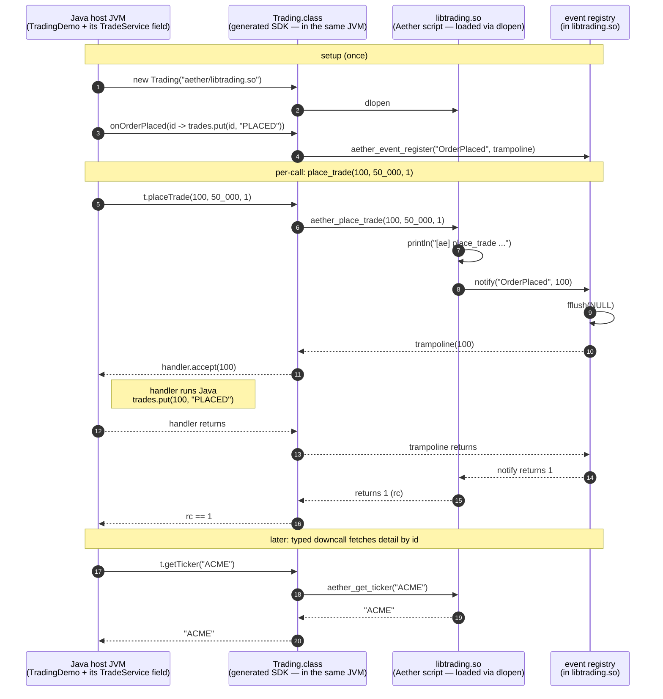
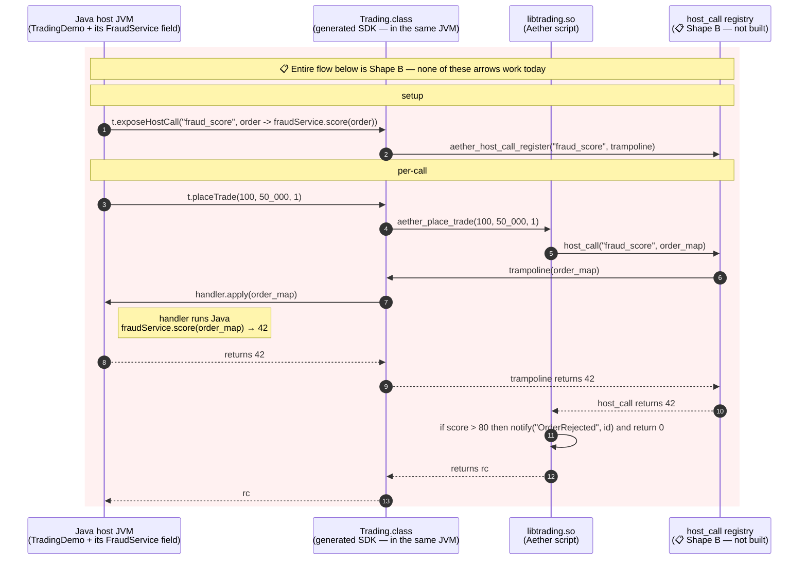

# Aether as a Configuration Language — v2: Namespaces and Generated Bindings

A host application embedding Aether scripts gets a typed, idiomatic SDK
in its own language (Java, Python, Ruby — Go stubbed) generated from a
single manifest written in Aether itself. The host developer never
writes JNI, never writes SWIG `.i` files, never registers callback
function pointers by hand.

> **Status (2026-04-18):** **shipped.** Landed on `feature/embedded-namespaces`
> (PR #172, 11 commits). Worked example at `examples/embedded-java/trading/`,
> integration tests at `tests/integration/namespace_{python,ruby,java}/` and
> `tests/integration/embedded_java_trading_e2e/`. See the embedded-namespaces
> entries in `CHANGELOG.md`.
>
> Out of scope for v1 (each tracked below):
> - Live host-supplied callbacks (`host_call`) — Shape B
> - Escape-hatch `import trading.manifest` for a non-sibling script
> - `@private_to_file` annotation
> - Wall-clock timeout / allocation budget
> - Go SDK generator (parser captures the binding; emitter is a stub)

## Goals and non-goals

**Goals.**

1. The Aether-side surface a *script* author writes is unchanged from
   what they write today — top-level functions, trailing-block DSLs,
   `notify()` for events back to the host. No mention of the host
   language. No FFI ceremony.

2. The host-side surface a *Java/Python/Ruby/...* developer reads is a
   normal typed library in their language. No `dlopen`, no
   `MemorySegment`, no `ctypes.CDLL`, no manual callback registration.
   Methods, events, fields, named like the Aether functions they wrap.

3. The generated SDK is **discoverable at runtime**. A standard
   `aether_describe()` entry point returns the namespace's manifest —
   typed, machine-readable, embedded in the `.so` — so version
   checks, IDE tooling, and reflective frameworks all work without
   shipping a sidecar JSON.

4. The callback contract follows the Hohpe **claim check** pattern:
   the script emits thin notifications (`notify("OrderRejected", id)`)
   and the host calls back into the script through the same typed
   downcall API to fetch detail. No bidirectional struct marshalling
   in v2.

**Non-goals.**

1. **No Swagger / OpenAPI emission.** The manifest itself, surfaced
   via `aether_describe()`, is the canonical typed contract. Anyone
   wanting to derive Swagger from it can; we don't.

2. **No live closure handles held by the host.** Closures still don't
   cross the boundary. Host registers per-event callbacks (the claim
   check listener) but does not pass anonymous functions into the script.

3. **No "rich struct" boundary marshalling.** Inputs limited to
   primitives, strings, maps, lists, and arrow-typed functions over
   primitives. Bigger payloads go through a `map` and the script walks it.

4. **No hot reload in v2.** A separate concern; if needed, build on
   top.

5. **No SWIG.** Each per-language SDK generator is hand-written against
   the target's native FFI: ctypes (Python), Panama (Java, JDK 22+),
   Fiddle (Ruby). The original design called for SWIG; in practice the
   per-target generators are small enough (~200-400 lines each) and the
   templating control gained is worth the duplication.

## The shape, in one example

A **trading** namespace with three scripts that share a single manifest.
This is the worked example that ships at `examples/embedded-java/trading/`.

### Directory layout

```
examples/embedded-java/trading/
    aether/
        manifest.ae          # the namespace definition (one per directory)
        placeTrade.ae        # contributes place_trade()
        killTrade.ae         # contributes kill_trade()
        getTicker.ae         # contributes get_ticker()
    java/src/main/java/TradingDemo.java
    build.sh
```

The convention: every `.ae` file in the directory contributes its
top-level public functions to the namespace declared by `manifest.ae`.

### `aether/manifest.ae` (as shipped)

```aether
import std.host

abi() {
    describe("trading") {
        input("max_order", "int")
        event("OrderPlaced",   "int64")
        event("OrderRejected", "int64")
        event("UnknownTicker", "int64")
        event("TradeKilled",   "int64")
        bindings() {
            java("com.example.trading", "Trading")
        }
    }
}
```

The grammar shipped slightly different from the original `namespace("trading") {...}` design:
the outermost call is `abi()` (Application Binary Interface — a less-overloaded acronym
than "API," which now connotes HTTP-over-JSON). Inside, `describe("name") { ... }` carries
the nested builders. Every form is a function call with a trailing block — pure Aether,
no new lexer or parser work, same trailing-block + `_ctx`-injection idiom as
TinyWeb's `path() { end_point(...) }` or `examples/calculator-tui.ae`'s
`grid() { btn(...) callback { ... } }`.

### `aether/placeTrade.ae` (as shipped)

```aether
place_trade(order_id: int64, amount: int, ticker_known: int) {
    println("[ae] place_trade order_id=${order_id} amount=${amount}")
    if amount < 0 || amount > 100000 {
        notify("OrderRejected", order_id); return 0
    }
    if ticker_known == 0 {
        notify("UnknownTicker", order_id); return 0
    }
    notify("OrderPlaced", order_id); return 1
}
```

What's worth noticing about the script:

- It mentions no host language. Nothing about Java, JVM, JNI.
- `notify(event, id)` is the only host-callback primitive. It's the
  claim check — the host gets the ID, and if it wants the trade detail
  it calls `get_ticker()` (or whatever the script exposes) over the
  normal downcall path.
- `[ae]` prefix on `println` is a convention so the demo's stdout makes
  it obvious which lines came from inside the embedded script vs. the
  Java host.

### What the Java developer writes (the actual `TradingDemo.java`)

```java
import com.example.trading.Trading;

try (Trading t = new Trading("aether/libtrading.so")) {

    // Discovery — confirm the loaded namespace is what we expected.
    Trading.Manifest m = t.describe();
    System.out.println("Loaded " + m);

    // Inputs — typed setters generated per `input(...)` declaration.
    t.setMaxOrder(100_000);

    // Event handlers — typed `LongConsumer` per `event(...)` declaration.
    t.onOrderPlaced(id -> trades.put(id, "PLACED"));
    t.onTradeKilled(id -> trades.put(id, "KILLED"));
    t.onOrderRejected(id -> System.out.println("[event] OrderRejected " + id));
    t.onUnknownTicker(id -> System.out.println("[event] UnknownTicker " + id));

    // Direct downcalls — typed methods named after the Aether functions.
    int rc = t.placeTrade(100L, 50_000, 1);
    t.killTrade(100L);
    String ticker = t.getTicker("ACME");
}
```

What the Java developer didn't have to write:

- A SWIG `.i` file
- A JNI / Panama `MethodHandle`
- A `MemorySegment` allocation, layout, or arena
- Any explicit `dlopen` call
- Any function pointer registration

What's there is a typed Java class with `set*` for inputs, `on*` for
events, and methods named after the Aether functions, implementing
`AutoCloseable` so try-with-resources releases the `Arena`.

## How it composes with `--emit=lib`

The transport layer (shipped on the same branch, foundation commit `991a72e`):

- `aetherc --emit=lib` produces a `.so`/`.dylib`.
- `aether_<name>(...)` exports for every top-level Aether function.
- `runtime/aether_config.h` accessors for walking returned maps/lists.
- Capability-empty default (no `std.net|http|tcp|fs|os` in lib mode).

Layered on top by v2 (the rest of the branch):

| New piece | Where it lives | Purpose |
|---|---|---|
| `std.host` Aether module | `std/host/module.ae` + `runtime/aether_host.{h,c}` | DSL: `describe`, `input`, `event`, `bindings`, `java`, `python`, `ruby`, `go` — the manifest grammar |
| `notify(event: string, id: int64)` extern | `runtime/aether_host.c` | Claim check; the only host-callback primitive |
| Manifest extractor | `aetherc --emit-namespace-manifest <m.ae>` | Walks the parsed AST, prints declaration-order JSON to stdout |
| Embedded discovery struct | `aetherc --emit-namespace-describe <m.ae> <out.c>` | Self-contained `.c` stub: static const `AetherNamespaceManifest` + `aether_describe()` entry |
| Per-language SDK generators | `tools/ae.c::emit_{python,java,ruby}_sdk` | Templates that turn the manifest into a Python ctypes module / Java Panama class / Ruby Fiddle module |
| New compile entrypoint | `ae build --namespace <dir>` | Orchestrates the manifest extract + transport-layer compile + per-language SDK generation |

The transport layer is not visible to either the script author or the
host developer in v2. They see the namespace SDK; the transport layer
is plumbing underneath.

## The manifest grammar in detail

`std.host` defines the manifest builder. Every form below is a function
call (or builder block) — pure Aether, no new lexer or parser work.

```aether
import std.host

abi() {
    describe(name: string) {
        // name becomes the runtime namespace identifier.
        // Used for the discovery struct, generator output naming, etc.

        input(<name>, <type_signature>)
            // Declares a host-supplied value the namespace makes
            // available. v1: stored on the SDK instance — the script
            // doesn't yet read inputs back at runtime (host_call /
            // ambient input access is Shape B).
            //
            // Allowed types in v1:
            //   primitives: int, long, float, bool, string

        event(<EventName>, <carries_type>)
            // Declares an event the script may emit.
            // v1: `carries` is restricted to `int64` (the claim-check ID).
            // Each event becomes an `on<EventName>(handler)` method
            // on the host SDK.

        bindings() {
            java(<package>, <class>)
            python(<module>)
            ruby(<module>)
            go(<package>)        // parser accepts; emitter stubbed
        }
    }
}
```

Two compiler enhancements were needed to make the trailing-block
manifest grammar land cleanly (commit `67ffa43`):

1. The `_ctx`-first builder pre-pass in `codegen.c` now also recognizes
   externs from imported modules — previously it only walked locally-defined
   functions, so `std.host`'s externs were missed.
2. Auto-injection at call sites fires whenever the user's arg count is
   exactly one less than the function's declared param count — previously
   gated on `gen->in_trailing_block > 0`, which broke the outermost call
   in a manifest's body.

## Namespace membership

**Shipped (default).** Every `.ae` file in the same directory as
`manifest.ae` contributes its top-level functions to the namespace.

```
trading/
    manifest.ae      # declares describe("trading")
    placeTrade.ae    # place_trade() automatically in namespace
    killTrade.ae     # kill_trade() automatically in namespace
    getTicker.ae     # get_ticker() automatically in namespace
```

`ae build --namespace <dir>` discovers sibling `.ae` files, deduplicates
`import` lines and at-most-one `main()`, and concatenates them into one
synthetic translation unit before running `--emit=lib`.

**Future (`@private_to_file` annotation).** A `.ae` file in the
namespace directory that does not want to be part of the namespace
would mark itself with an annotation. Aether doesn't have annotations
today; alternatives include a manifest-level `exclude ["internal_helpers.ae"]`
or a leading-underscore convention. Not yet shipped.

**Future (escape hatch via explicit `import`).** A script that lives
elsewhere could opt into a namespace by importing its manifest. Would
require the import resolver to recognize manifest paths as namespace
joins, not just module pulls. Not yet shipped.

## The claim-check callback model

Aether-side primitive in `std.host`:

```aether
extern notify(event: string, id: int64) -> int    // 0 = no listener, 1 = delivered
```

C-side dispatch table (`runtime/aether_host.c`):

```c
typedef void (*aether_event_handler_t)(int64_t id);

int aether_event_register(const char* event_name, aether_event_handler_t handler);
int aether_event_unregister(const char* event_name);
void aether_event_clear(void);

int notify(const char* event_name, int64_t id) {
    int idx = find_event_index(event_name);
    if (idx < 0) return 0;
    fflush(NULL);                       // see "stdio interleaving" below
    g_events[idx].handler(id);
    return 1;
}
```

Linear-search registry capped at 64 events (raisable). The host SDK's
`on<EventName>(handler)` calls `aether_event_register` under the
covers. Each per-language SDK supplies its own trampoline:

- **Python** uses `CFUNCTYPE`, holds the trampoline in `self._callbacks`
  so the GC doesn't reclaim it while C still has the pointer.
- **Java** uses `Linker.upcallStub` via `MethodHandles.publicLookup().findVirtual`
  on `LongConsumer.accept` (sidesteps the lambda nestmate-private lookup error).
- **Ruby** uses `Fiddle::Closure::BlockCaller`, holds it in `@callbacks`.

Why claim check and not richer callbacks:

- **Marshalling.** `notify(name, id)` crosses the boundary as
  `(const char*, int64_t)` — two primitives. No struct marshalling.
- **Auth and freshness on the host side.** The host's `getIfAuthorized(id)`
  decides whether the listener is allowed to see this trade, and gets
  current state. The script doesn't know or need to know.
- **Decoupled lifecycles.** Add a new listener without touching the script.
- **Folklore.** Hohpe's claim check pattern, EAI book, decades of
  message-queue experience converging on this. We're not inventing.

When you genuinely need richer host → script communication, the
script's typed downcall functions (`get_ticker(symbol)`, `kill_trade(id)`)
already give you that — the host calls them directly, no events involved.

### Stdio interleaving

When loaded as a `.so` by a host (Java/Python/Ruby) via `dlopen`,
libc's `stdout` is fully buffered (the `.so` doesn't see a TTY).
Without intervention, script-side `println()` calls accumulate in
the C-side buffer and only flush at process exit — so demo console
output appears scrambled (host event-handler `println`s land in
order, but the Aether script's preceding lines all come out at the
very end).

`notify()` calls `fflush(NULL)` before invoking the registered handler
so anything the script printed leading up to the event surfaces in
the right order. Cosmetic-only — the values returned by the script
are unaffected; only the on-screen ordering of pre-event log output.

## What works today vs. what's Shape B

Two sequence diagrams. Same trading example; the first shows the
round-trip that works in v1, the second shows the case the script
*can't* express today and which `host_call` (Shape B) would unlock.

### Works today: claim-check round-trip

The host calls a script function. Mid-execution the script emits an
event with a thin id payload. The registered host handler runs
synchronously, persists state under that id, and returns. The script
finishes and returns its own value. Later (or in the same Java
statement after `placeTrade` returns), the host makes a second typed
downcall to fetch detail by id from its own service.

> **A note on the lifelines.** All four lifelines below are one OS
> process — the JVM `dlopen`s `libtrading.so` and the `.so` runs in
> the JVM's address space, on the JVM's threads. There's no IPC, no
> fork, no separate scheduler. The lifelines mark where calls cross
> a *marshalling* boundary, not an execution one: `Host`↔`SDK` is a
> normal Java method call, `SDK`↔`Lib` is the Panama (or ctypes /
> Fiddle) FFI crossing where Java values get reboxed as C values,
> `Lib`↔`Reg` is a plain C call inside the `.so`. Treat the
> lifelines as "where does the next call cost something?"



The whole thing crosses the C ABI as primitives: an `int64_t` id, a
`const char*` event name, return codes. No structs marshalled, no
closures held by the host beyond the event handler the host itself
owns.

### Shape B (not yet shipped): script calling into host

What if `place_trade` needs the *current* fraud score from a running
Java service mid-evaluation? The score isn't an `input` we can
pre-pass — it depends on the order amount and is recomputed live.
And it's not something the script can `notify` for, because `notify`
is fire-and-forget with no return value.

The only escape today is: pre-compute *every value the script might
need* and pass it as an `input(...)`. That works when the inputs are
small and bounded; it falls down when the script wants to do an
ad-hoc lookup against host state.

`host_call(name, ...)` would be a new extern that crosses the
boundary in the script → host direction, returning a value the
script can branch on.

> Same lifeline convention as the first diagram — all four are one
> OS process, the lifelines mark marshalling boundaries, not
> execution contexts.



The pink-shaded rect marks every arrow inside as not implemented today —
the `host_call` registry, the script-side `host_call("name", ...)`
extern, and the host-side `exposeHostCall(...)` registration API are
all illustrative. The actual API will be settled when the work is
scheduled.

Why this is harder than `notify`:

- **Return values cross the boundary.** `notify` is `void` from the
  script's perspective (well, `int` for delivered/not-delivered, but
  no payload). `host_call` returns a value the script will branch on,
  which means the C-ABI return type has to be `void*` / `AetherValue*`
  and the script-side codegen has to know how to unbox it.
- **Argument marshalling is variadic.** `notify` takes `(name, id)`.
  `host_call` takes `(name, ...)` with arbitrary argument types per
  registered host call. Either we restrict arg types to the same
  primitives `input(...)` accepts (probably right for v1 of Shape B),
  or we marshal everything through `AetherValue*` (heavier but more
  general).
- **Lifecycle of host-supplied closures.** The Java/Python/Ruby
  trampoline has to outlive the script's call into it. Same keepalive
  problem as event handlers, just on the other side of the boundary.

These are tractable — none of them are research problems — but they're
the reason Shape B is a deliberate v2 deferral and not a one-day add.

## Marshalling: cost and safety

The lifelines in the diagrams are marshalling boundaries; this
section says what each kind of crossing actually costs and what can
go wrong.

### Marshalling cost per type

Per-call overhead, not amortized startup. Numbers are order-of-
magnitude; measure in your own host before optimizing.

| Crossing | What happens | Cost |
|---|---|---|
| `int`, `int64`, `bool` | Register-passed primitive — Panama / ctypes / Fiddle widen or pun bits, no allocation | ~tens of ns per call. JIT can't inline across the FFI but otherwise free |
| `string` (host → script) | Java `String` (UTF-16 internally) → encode UTF-8 → `arena.allocateFrom` → null-terminate → pass `MemorySegment.address()` as `const char*` | One allocation + one encoding pass + linear copy, all O(length). Cheap for `"ACME"`, real for >1 KB |
| `string` (script → host) | Aether returns `const char*` (already UTF-8) → host does `MemorySegment.getString(0)` → scan for `\0` → decode UTF-8 → allocate a Java `String` | One allocation + one decoding pass + linear scan + linear copy. Same shape as the inbound direction |
| Event handler registration | `Linker.upcallStub(MethodHandle, FunctionDescriptor, Arena)` generates a tiny native trampoline at runtime that, when called from C, marshals back into the JVM and invokes the handler | One-time cost per `on<Event>(...)` call (microseconds). Subsequent invocations pay the trampoline overhead (~tens of ns per call) |
| `notify(name, id)` (script → host event) | `(const char*, int64_t)` — primitives only. No allocation, no encoding | Two register-passes + a strcmp-based dispatch lookup + the trampoline overhead. Sub-microsecond |
| Maps / lists / structs | **Not in v1** — Aether composite values would marshal via `aether_config_*` accessors, one FFI call per field walk | Quadratic in the worst case (FFI per accessor × depth). The reason `input(...)` is restricted to primitives + strings |

The asymmetry worth flagging: **strings cost more than primitives in
both directions** (encoding/decoding + allocation), and **callbacks
pay a one-time setup cost but a per-invocation trampoline cost
forever.** A trading scenario calling `place_trade(id, amount, ticker_known)`
once per HTTP request is unaffected — three primitive args are
microseconds at most. A scenario passing 10 KB JSON strings through
`label("...", ...)` at 100 K calls/sec would feel it.

### Memory safety at the boundary

The FFI boundary is exactly where C's "trust the caller" memory
model meets Java/Python/Ruby's "the runtime owns it" model. The
generators try to shield host authors from the worst sharp edges,
but some are unavoidable in v1. Honest accounting:

| Hazard | Risk in v1 | What protects you |
|---|---|---|
| **Buffer overflow (write)** | Low | Aether `string` is `const char*` and the host's marshallers (`MemorySegment.getString`, `ctypes.c_char_p`, `Fiddle::Pointer.to_str`) all allocate fresh host-language strings — they never write through the C pointer |
| **Read past end of unterminated string** | Low — but real if a future Aether stdlib function returns a non-null-terminated buffer | Convention: every `const char*` returned by an Aether function is null-terminated. The compiler's string codegen guarantees this today; a hand-written extern could break it |
| **Use-after-free: returned strings** | Medium | Strings returned by `aether_<name>(...)` are borrowed pointers into Aether's heap. Lifetime is "until the next Aether call into the same `.so`." Hosts that hold the pointer past that point will see freed memory. Each per-language SDK eagerly copies the string out (via `getString` / decode) before the call returns, which is the right pattern — but a host author bypassing the SDK and calling the raw `aether_<name>` symbol directly could trip on this |
| **Use-after-free: callback trampolines** | Medium | The Python/Ruby/Java SDKs hold each registered callback in `self._callbacks` / `@callbacks` / a final field on the SDK instance so the host-language GC doesn't reclaim it while C still has the function pointer. If a host author rebinds those collections (`self._callbacks = []`) or replaces the SDK instance while a `notify` is in flight on another thread (see concurrency, below), UAF |
| **Double-free** | Low | The script doesn't hand the host any owned memory the host is supposed to free. Everything returned is borrowed from Aether's heap. If a future ABI version adds owned-string returns, this risk reappears |
| **Integer truncation / sign confusion** | Low | `notify(name, id)` is `int64_t`. Java `long`, Python arbitrary-precision `int` (ctypes silently masks to 64-bit), Ruby `Integer` (Fiddle truncates). Garbage-in/garbage-out, no crash — but a Python host passing `2**70` will see a different `id` on the script side than it expected |
| **String encoding mismatch** | Low | All three SDKs default to UTF-8 for the FFI marshal. A host that explicitly forces UTF-16 or Latin-1 would see garbage |
| **Concurrency: races on the dispatch table** | **Real and undocumented** | The Aether runtime is single-threaded. The `g_events[]` registry and `g_manifest` are NOT mutex-guarded. A Java host calling into the `.so` from two threads concurrently can race `aether_event_register` against `notify`, with possible UAF on the handler pointer. **Today's contract is "host serializes all calls into the SDK."** Not enforced anywhere; not even mentioned in the SDK comments. Worth fixing before v1 ships to anyone who didn't write the runtime |
| **Capability escape via raw `extern`** | **Real gap** | The capability-empty link profile excludes `std.fs`, `std.net`, etc. — so `import std.fs` in a script is rejected. But a malicious script author can declare their own `extern open(path: ptr, flags: int) -> int` directly, and the linker (which doesn't know about Aether's capability model) will happily resolve it against libc. The compile-time capability check inspects imports, not raw externs. This is a real escape — though "malicious script author" is a meaningful threat model only when the host is loading scripts from untrusted sources |

The two **real and undocumented** rows above (concurrency and raw
`extern` escape) are the items most worth fixing before this layer
gets serious adoption. They're listed in "Open questions" below.

## The discovery method

The manifest description is serialized into a static struct embedded in
the produced `.so`. A standard entry point exposes it:

```c
// runtime/aether_host.h
typedef struct AetherInputDecl {
    const char* name;
    const char* type_signature;   // "int", "string", ...
} AetherInputDecl;

typedef struct AetherEventDecl {
    const char* name;
    const char* carries_type;     // "int64"
} AetherEventDecl;

typedef struct {
    const char* package_name;
    const char* class_name;
} AetherJavaBinding;

typedef struct {
    const char* module_name;
} AetherPythonBinding;

typedef struct {
    const char* module_name;
} AetherRubyBinding;

typedef struct AetherNamespaceManifest {
    const char* namespace_name;
    int input_count;     const AetherInputDecl* inputs;
    int event_count;     const AetherEventDecl* events;
    AetherJavaBinding   java;
    AetherPythonBinding python;
    AetherRubyBinding   ruby;
    AetherGoBinding     go;
} AetherNamespaceManifest;

const AetherNamespaceManifest* aether_describe(void);
```

What this gets us:

- **Runtime contract verification.** When the host loads the `.so`, it
  can confirm "the loaded namespace is `trading`" before calling
  anything. Catches the "wrong `.so` deployed" class of bug at startup
  rather than at first call.

- **Reflective tooling.** IDE plugins, doc generators, contract testers
  walk the manifest. No need to ship a sidecar JSON or re-parse the
  Aether source.

- **Convertible to other contract formats.** A small program walks the
  manifest and emits Swagger, gRPC `.proto`, GraphQL SDL, JSON Schema,
  or whatever's needed downstream. We don't ship those emissions
  ourselves; the manifest is canonical.

The discovery struct is also surfaced on each host SDK as a typed
convenience:

```java
Trading.Manifest m = t.describe();
// m.namespaceName, m.inputs, m.events, m.javaPackage, m.javaClass
```

```python
m = ns.describe()   # m.namespace_name, m.inputs, m.events, m.python_module
```

```ruby
m = ns.describe     # m.namespace_name, m.inputs, m.events, m.ruby_module
```

## Test coverage

| Test | What it proves |
|---|---|
| `tests/integration/notify/` | `notify(event, id)` reaches a registered handler; missing handler returns 0; replace-in-place re-registration; unregister; clear; NULL-safety |
| `tests/integration/manifest/` | Every manifest builder (`describe`, `input`, `event`, `bindings`, `java`, `python`, `ruby`, `go`) round-trips through `manifest_get()` |
| `tests/integration/namespace_basic/` | Manifest interpreter resolves a 1-script namespace correctly |
| `tests/integration/namespace_multifile/` | Sibling scripts contribute to one namespace; SDK exposes all functions |
| `tests/integration/namespace_python/` | Generated Python SDK round-trips: discovery, setters, events, functions |
| `tests/integration/namespace_ruby/` | Same surface, mirrored for Ruby Fiddle |
| `tests/integration/namespace_java/` | Same surface, mirrored for Java Panama |
| `tests/integration/embedded_java_trading_e2e/` | Full worked example: manifest + 3 scripts + Java host that exercises every input, every event, every function. Asserts the round-trip end-to-end including `[ae]`-tagged script-side prints interleaving with host event handlers |
| `tests/integration/emit_lib*/` | The transport layer underneath (8 directories, foundation tests) |

Skip-on-missing-toolchain is the standard pattern: Java targets skip
cleanly if `javac`/`java` aren't installed or the JDK is older than 22;
Python skips if `python3` isn't installed; Ruby skips if `ruby` isn't
installed.

## Open questions

A handful of decisions deferred from the v1 ship:

1. **Multiple manifests in one directory.** Currently undefined behavior.
   Probably want to ban it explicitly with a clear error.

2. **What `aether_describe()` returns when the same `.so` is loaded
   twice in one process.** Currently fine since it's static state, but
   worth documenting before someone tries it in earnest.

3. **How the event handler gets called when the script is on a
   different thread than the host's main loop.** The runtime is
   single-threaded today and `notify` is synchronous, so v1 inherits
   that — events fire on whatever thread is currently running Aether
   code. Documented; revisit if multi-threading lands.

4. **Annotation syntax for `@private_to_file`.** Aether doesn't have
   annotations today. Alternatives: a manifest-level
   `exclude ["internal_helpers.ae"]`, or a leading underscore
   convention. The manifest-level approach is probably cleanest because
   it keeps the policy in the namespace owner's hands.

5. **Concurrency contract on the SDK.** The C-side dispatch table
   (`g_events[]`) and the manifest registry (`g_manifest`) are not
   mutex-guarded. The implicit contract today is "the host serializes
   all calls into the SDK from one thread at a time," but this is not
   documented anywhere and is easy to violate from a Java host that
   dispatches HTTP requests on a thread pool. Two fixes worth
   considering: (a) document the contract loudly in each generated
   SDK's class header so a host author has to opt into the
   single-threaded model knowingly, or (b) add a coarse
   `pthread_mutex_t` in `aether_host.c` so concurrent calls serialize
   transparently. (b) is the friendlier default for v2 hosts; (a)
   keeps the runtime free of pthread dependencies.

6. **Capability escape via raw `extern` declarations.** The
   capability-empty link profile inspects `import` statements but
   doesn't catch a script that declares its own
   `extern open(path: ptr, flags: int) -> int` to reach libc directly.
   Real escape, but only matters when the host loads scripts from
   untrusted sources. Fix: extend the compile-time capability check
   to enumerate raw extern declarations against an allowlist
   (currently `notify` and the manifest builders).

## Summary

v2 takes the typed transport layer from `--emit=lib` and adds:

- **A namespace-level manifest written in Aether**, defining inputs,
  events, and per-language bindings once for a directory of related
  scripts.
- **A claim-check callback model** (`notify(event, id)`) that sidesteps
  rich-struct boundary marshalling by deferring all detail fetching to
  the host's typed downcalls into the script.
- **A discovery method** (`aether_describe()`) embedded in every
  generated `.so`, exposing the manifest as a typed runtime contract.
- **Hand-written per-language SDK generators** (Python ctypes, Java
  Panama JDK 22+, Ruby Fiddle) that template idiomatic SDKs from the
  manifest, hiding JNI, ctypes, Panama, Fiddle, and all FFI plumbing
  from both the script author and the host developer.

The result: a Java developer consuming an Aether-built `trading.so`
sees a typed `com.example.trading.Trading` class with `setMaxOrder`,
`onOrderPlaced`, `placeTrade`, `getTicker`, and `t.describe()`. They
write no glue. The script author writes plain Aether and a manifest.
Neither side knows about the boundary.

The transport layer (`--emit=lib`, `aether_config.h`, opaque
`AetherValue*`) folds in as the foundation. There is no v1 to maintain
backward compatibility against — v2 is the first shipped surface.
